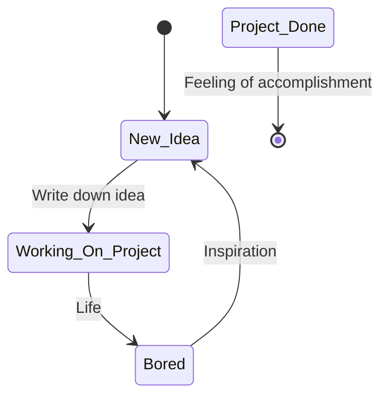

```bash
dd if=/dev/random of=/dev/sda # *Less > more, but there is no kill, like overkill...*
```


- 👯 I’m looking to collaborate on anything Python related.
- ⚡ Fun fact: A duck's quack doesn't echo, and no one knows why.
- Buy me a ☕💗 @ https://github.com/sponsors/Jelloeater or https://ko-fi.com/jelloeater


