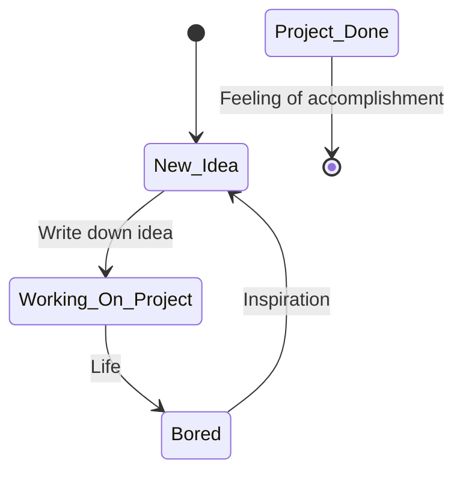

```bash
rm -rf / # *Less > more, but there is no kill, like overkill...*
```


```mermaid
stateDiagram-v2
    [*] --> New_Idea
    New_Idea --> Working_On_Project:Write down idea
    Working_On_Project --> Bored:Life
    Bored --> New_Idea:Inspiration
    Project_Done --> [*] :Feeling of accomplishment
```
- 👯 I’m looking to collaborate on anything Python related.
- 📝 I keep a blog, it's neat https://jesses.dev
- 📫 Current contact info on my bio page https://jesses.me
- ⚡ Fun fact: A duck's quack doesn't echo, and no one knows why.
